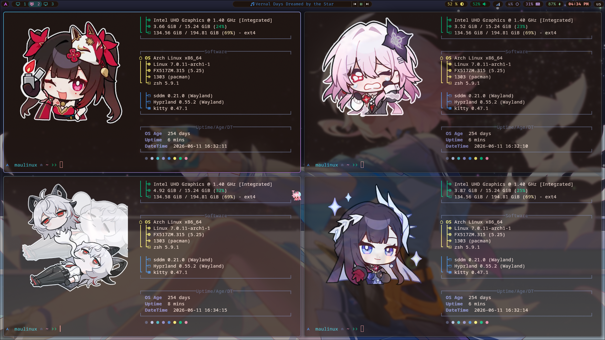
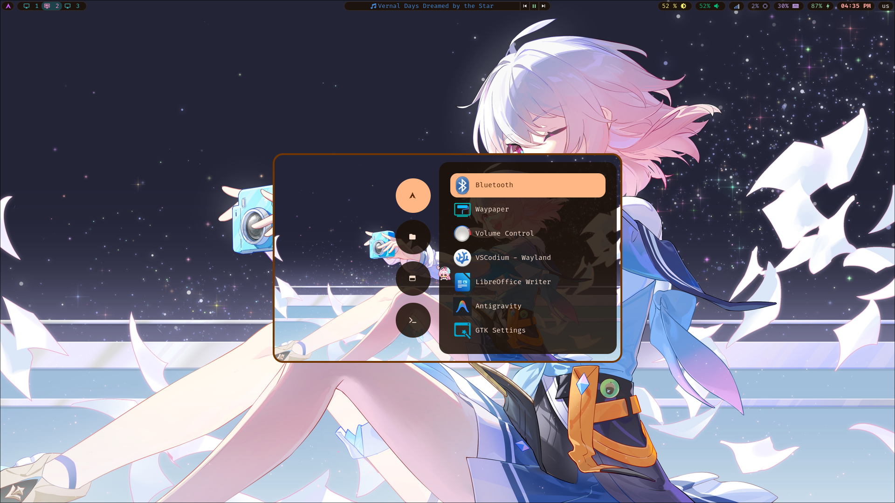
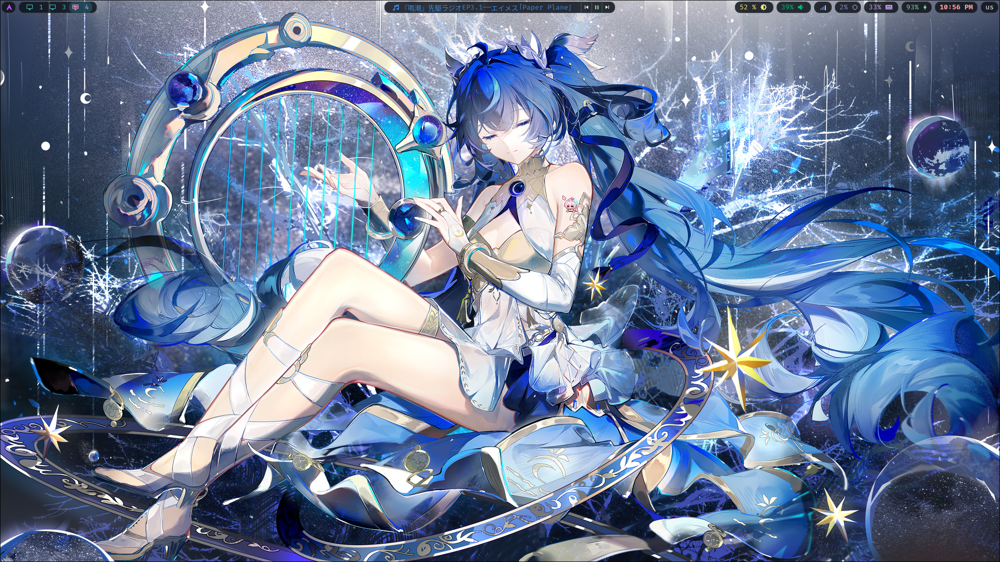
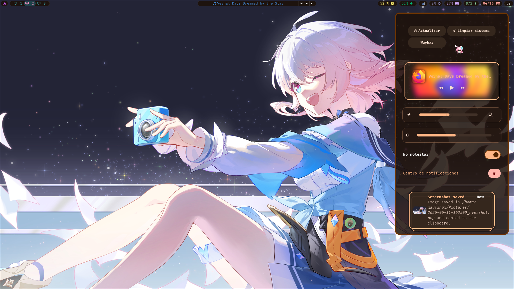
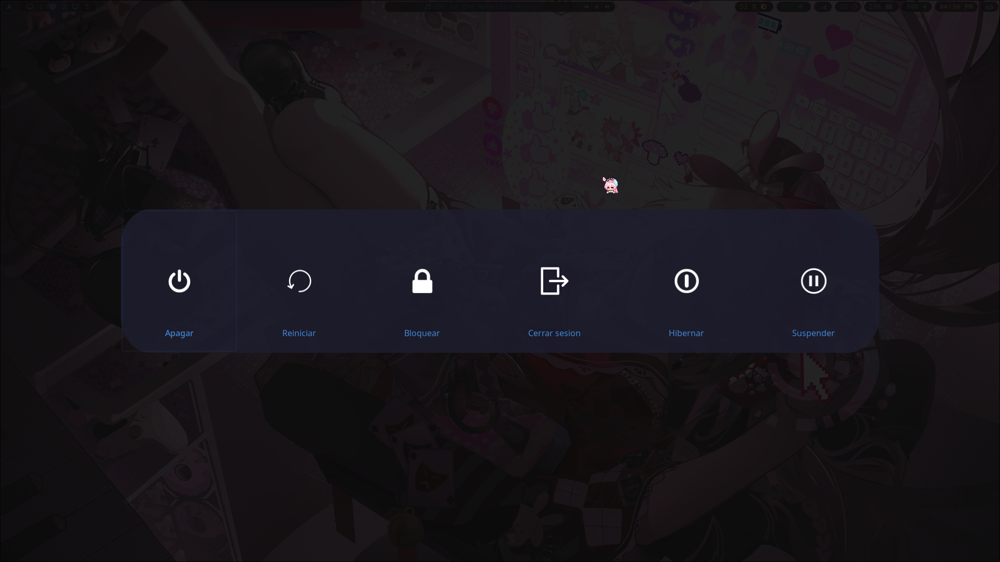
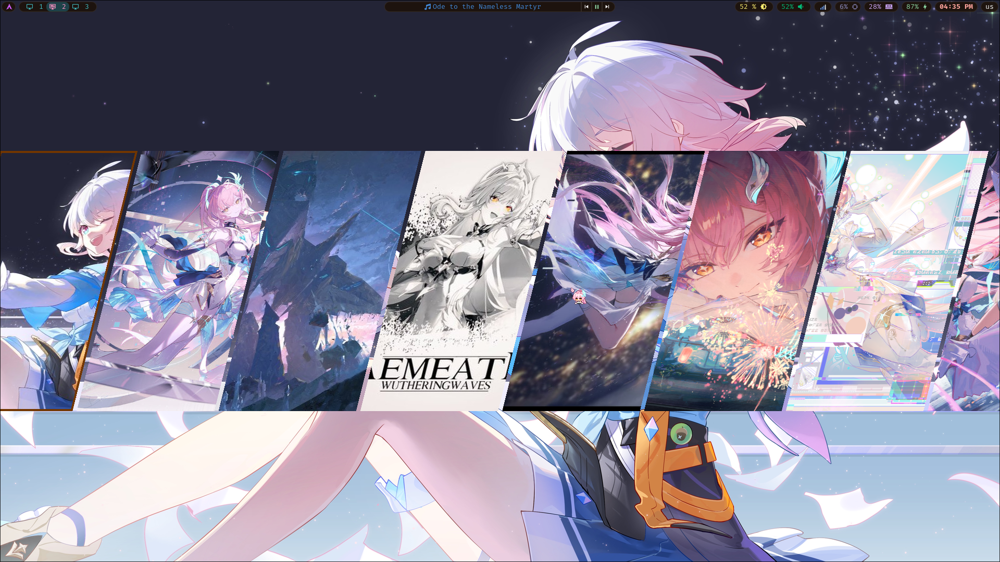
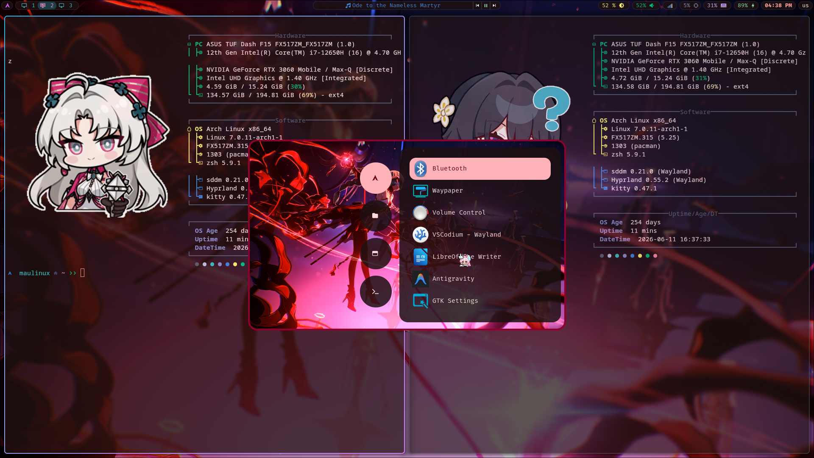

# Hyprland Ricing
<p align="center">
    

This dotfiles was made for archlinux
---
## Dependencies
```
kitty
thunar
quickshell
waybar
swaync
awww
blueberry
poweralertd
quickshell-overview-git
wlogout
hyprshot
rofi
hyprlock
waypaper
cava
matugen
```

### Terminals
`kitty` + `fastfetch`


### AppLauncher
`rofi`


### Bar & widgets
`waybar` + `quickshell` + `quickshell-overview-git`


### Notifications
`swaync`


### Logout Menu
`wlogout`


### Wallpaper Selector from
`https://github.com/iamsurjog/hyprquickpaper`


### Automatic theme by wallpaper colors
`matugen`

